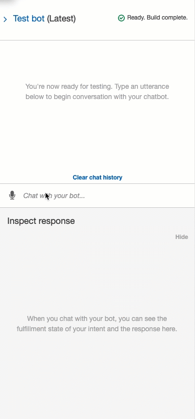
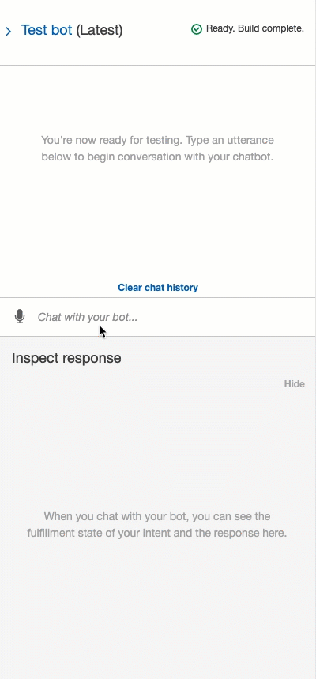

# Enhancing the Bitcoin Fear & Greed Advisor

In this activity, you will add an AWS Lambda function to the Bitcoin Advisor bot you created before. This Lambda function will fetch the current "Bitcoin Fear & Greed Index" using [the Alternative.me crypto API](https://alternative.me/crypto/fear-and-greed-index/). Also, the current price of bitcoin will be retrieved using another endpoint of [the same API](https://api.alternative.me/v2/ticker/bitcoin/?convert=USD).

## Instructions

### Create the Lambda Function

1. Log-in into the AWS Management Console using your IAM administrator user. Once you are logged in, type `Lambda` into the AWS services search box and click on "Lambda" to open the AWS Lambda console.

2. In the AWS Lambda console, click on "Functions" on the left side menu; continue by clicking on the "Create function" button.

3. On the Create function page, select the "Author from scratch" option, fill out the following information, and click on the "Create function" button to continue.

    * Function name: `getFGIndex` (This is the name to identify our new Lambda function).

    * Runtime: Python 3.7

4. Scroll down to the "Code source" section and copy and paste the starter code provided to the code editor on the AWS Lambda console. You may have to double click the `lambda_function.py` file in the Environment pane to open the editor.

5. Inspect the code of the `get_df_index()` and `get_recommendation()` functions to understand how the "Bitcoin Fear & Greed Index" is retrieved and how the recommendation is made.

6. Click on the "Deploy" button and continue with the next section.

### Test the Lambda Function

1. Add two test events using the tests provided in the JSON files.

2. Run the tests and ensure that the Lambda function works correctly.

### Connect AWS Lambda and Amazon Lex

1. Open the Amazon Lex console to bind the `getFGIndex` lambda function to the "Bitcoin Advisor" bot.

2. Open the "Lambda initialization and validation" section, enable the Initialization and validation code hook option and select the `getFGIndex` Lambda function from the list. Make sure to select the Latest version.

3. Scroll down to the "Confirmation prompt" section and disable the checkbox, continue by opening the "Fulfillment" section and choose the "AWS Lambda function" option; select the `getFGIndex` Lambda and the `Latest` version.

4. Click on the Build button in the upper right corner. Congrats! Now the bot is connected to Lambda to control the user's intent.

5. Test the Lambda powered bot with some of the sample utterances; you should have a final conversation as it is shown below.

| _Bot demo conversation with valid user's data_ | _Bot demo conversation with invalid user's data_ |
| --- | ---|
|  |  |

### Optional Challenge

In this optional challenge activity you will give a recommendation on buying Bitcoin according to the average "Bitcoin Fear & Greed Index" over the last ten days.

If you look at the [alternative.me API documentation](https://alternative.me/crypto/fear-and-greed-index/#api) for this index you can corroborate that the API endpoint to retrieve the index values for the last ten days is the following: <https://api.alternative.me/fng/?limit=10>. Follow the steps bellow to use this endpoint and accomplish this optional challenge.

1. Modify the code of the `get_fg_index()` function to fetch the "Bitcoin Fear & Greed Index" from the last ten days using the following endpoint: <https://api.alternative.me/fng/?limit=10>.

2. The `get_fg_index()` should return the average value of the index from the last ten days.

3. Optionally, update the text messages that are in the `get_recommendation()` function to reflect what the market feelings are from the last then days.

4. Build your Lambda function and test the Bitcoin Advisor bot again.

    > **Note:** Since you only modified the AWS Lambda code, you don't need to re-build the bot.

---
© 2022 edX Boot Camps LLC. Confidential and Proprietary. All Rights Reserved.
